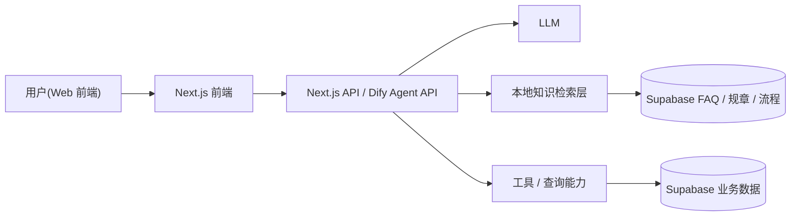
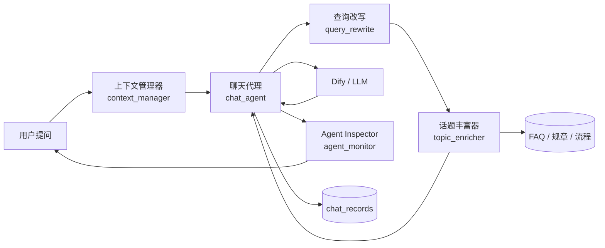
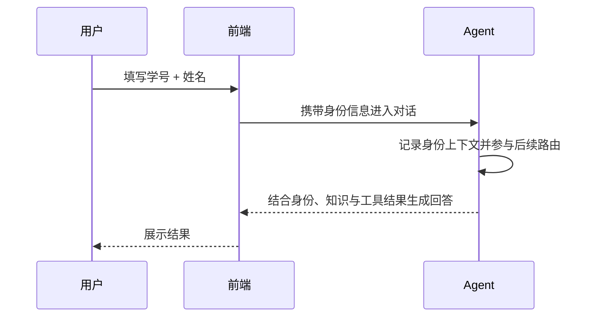

# 基于大语言模型智能体的校园咨询系统设计与实现 — 毕业论文
**作者**: 赵宇航 **学号**: 22205020230 **指导教师**: 王冬
**学院**: 安徽建筑大学

## 摘要

随着高校信息化建设不断推进，学生在课程安排、图书馆服务、校内规章和办事流程等方面的咨询需求持续增长。然而，现有校园信息服务普遍存在信息分散、检索入口不统一、人工答复效率有限以及问答结果缺乏连续性的现实问题。近年来，大语言模型在自然语言理解、上下文建模和复杂问答方面表现出较强能力，为构建新一代校园智能咨询系统提供了新的技术路径。针对传统校园问答系统智能性不足、知识更新不便和答案可解释性较弱等问题，本文设计并实现了一种基于大语言模型智能体的校园咨询系统。

本文以 Next.js 为前端框架，以 Dify 作为大语言模型智能体编排平台，以 Supabase/PostgreSQL 作为业务数据库与知识数据存储载体，构建了“身份采集—对话问答—知识检索—结果展示—后台维护”的完整系统链路。系统通过接入大语言模型实现自然语言交互，通过检索增强生成技术整合 FAQ、规章制度与办事流程等校园知识，并结合工具调用思想实现身份关联、知识命中、证据展示和多轮会话管理。与此同时，本文还设计了后台知识管理模块，使管理员能够直接维护 FAQ、规章与办事流程数据，从而形成“知识维护—问答调用—前台反馈”的闭环。

在系统实现层面，本文重点完成了动态身份表单、流式对话工作台、本地会话历史、知识命中证据展示、Agent Inspector 过程观察面板以及后台知识管理控制台等功能。为提升多轮场景下的检索稳定性，系统进一步加入了轻量级查询改写模块，在用户使用“那什么时候提交”“需要什么材料”等指代表达时，能够结合最近轮次的用户问题生成更完整的检索问句。为提升问答可信度，系统在回答正文下方展示知识来源标签，并在 Agent Inspector 中同步展示证据片段、查询改写事件与工具观察结果，从而增强了系统的可解释性与用户信任。测试与评估层面，本文实现了分层测试集、批量评测脚本以及响应时间埋点机制，为后续论文实验统计提供了可复用的数据基础。

**关键词**: 大语言模型; 智能体; 检索增强生成; 工具调用; 校园咨询系统

## Abstract

With the continuous advancement of campus informatization, students increasingly rely on online services for course schedules, library services, campus regulations, and administrative procedures. However, existing campus information systems often suffer from fragmented data sources, isolated service entrances, slow manual responses, and limited conversational continuity. In recent years, large language models have shown strong capabilities in natural language understanding, contextual reasoning, and complex question answering, which provides a new technical path for building intelligent campus consultation systems. To address the limitations of traditional campus Q&A systems in intelligence, knowledge maintenance, and answer explainability, this thesis designs and implements a campus consultation system based on a large language model agent.

The system adopts Next.js as the frontend framework, Dify as the agent orchestration platform, and Supabase/PostgreSQL as the business database and knowledge storage backend. A complete service chain is constructed, including identity collection, conversational interaction, knowledge retrieval, result presentation, and administrative maintenance. By integrating a large language model with retrieval-augmented generation, the system can make use of campus FAQ, regulations, and service process documents during answering. In addition, tool-calling ideas are incorporated to support identity-related interaction, local knowledge grounding, evidence display, and multi-turn session management.

At the implementation level, this work completes several key modules, including a dynamic identity form, a streaming chat workspace, local session history, source-aware evidence display, an Agent Inspector panel for observable reasoning traces, and an administrative console for maintaining campus knowledge. To improve retrieval robustness in multi-turn dialogue, the system further introduces a lightweight query rewriting module that rewrites context-dependent follow-up questions into more self-contained retrieval queries. To improve answer reliability, the system directly presents source labels such as FAQ, regulations, and service procedures under the final response, while synchronously exposing evidence snippets, query rewriting events, and tool observations in the monitor panel. In addition, a layered evaluation dataset, batch evaluation script, and response-time instrumentation are implemented to support reproducible experimental analysis.

**Keywords**: Large Language Model; Agent; Retrieval-Augmented Generation; Tool Calling; Campus Q&A System

---

# 第一章 绪论

## 1.1 研究背景与意义

高校日常运行中存在大量高频、重复且时效性较强的咨询场景，例如课程时间查询、缓考申请流程、图书馆借阅规则、规章制度解读和校园公共服务指引等。这些信息通常分散在教务系统、图书馆网站、学院通知、规章文件和人工答疑渠道中，导致学生需要在多个入口之间反复切换，不仅获取成本高，而且极易因为信息版本不一致而产生误解。传统 FAQ 系统虽然能提供固定问题的静态检索，但对自然语言理解、多轮追问和个性化回答的支持能力有限，难以满足当前校园服务“便捷化、智能化、统一化”的需求。

大语言模型的兴起为校园咨询系统升级提供了重要契机。一方面，大语言模型具备较强的语义理解、上下文建模和自然语言生成能力，能够将学生的口语化提问转化为结构清晰的回答；另一方面，智能体技术通过引入规划、检索、工具调用和记忆机制，使大语言模型不再只是“会说话”的模型，而是能够围绕任务完成展开感知、判断与行动的复合系统。在校园咨询场景中，这意味着系统不仅可以回答静态常见问题，还可以结合用户身份、校园知识库和数据库工具，为学生提供更贴合场景、更具依据的服务响应。

然而，如果直接将通用大语言模型用于校园咨询，也会面临知识幻觉、事实时效性不足、缺乏证据支撑和后台维护不便等问题。因此，有必要将大语言模型与校园本地知识、结构化数据库和面向管理员的内容维护机制结合起来，构建一个既具有智能交互能力，又具备知识可控性和结果可解释性的校园咨询系统。

本文设计并实现的基于大语言模型智能体的校园咨询系统，正是在这一背景下展开研究。该系统的现实意义主要体现在三个方面：第一，能够提升学生获取校园信息的效率，降低咨询门槛；第二，能够减轻教务、图书馆、行政部门在高频咨询上的人工压力；第三，能够为高校探索大语言模型在教育管理与服务领域中的落地应用提供参考样例和工程经验。因此，本课题兼具理论研究价值与较强的应用实践意义。

## 1.2 国内外研究现状

### 1.2.1 大语言模型与智能体研究

近年来，大语言模型从预训练语言模型逐步发展为具备复杂推理、任务规划和交互能力的基础模型。Wang 等对 LLM Autonomous Agents 进行了系统综述，指出大语言模型智能体通常由规划、记忆、工具使用和行动执行等部分构成 [8]。Luo 等进一步总结了 2025 年前后 LLM Agent 在方法、应用和挑战方面的发展趋势，表明智能体正在从简单问答走向复杂任务执行 [10]。Yao 等提出的 ReAct 框架则将推理与行动有机结合，使模型能够在思考与工具使用之间形成闭环 [3]。总体来看，国外相关研究已经从“让模型能回答”发展为“让模型能完成任务”，这为面向具体场景构建智能咨询系统奠定了理论基础。

### 1.2.2 检索增强生成（RAG）研究

Lewis 等提出的 RAG 模型通过将外部知识检索与文本生成结合，显著提升了知识密集型任务中的事实准确率 [1]。随后，大量研究围绕检索召回、重排序、自适应检索和异构知识融合展开。Gao 等从系统角度总结了 RAG 的核心流程、优化方向与应用挑战 [7]；Asai 等提出 Self-RAG，通过自反思机制提升检索与回答的一致性 [5]；Sawarkar 等和 Yan 等分别从混合检索与异构源融合角度推进了 RAG 在复杂场景中的应用 [14][15]。对于校园咨询系统而言，RAG 能够有效缓解通用大语言模型对本地规章、流程和服务细则不了解的问题，因此已经成为构建垂直领域问答系统的重要方法。

### 1.2.3 工具调用与 Agent 框架

工具调用是大语言模型从“语言生成器”走向“任务执行体”的关键能力。Schick 等提出 Toolformer，验证了语言模型可通过自监督方式学习何时调用外部工具 [4]。随着模型原生 Function Calling 机制的普及，越来越多的系统采用“模型理解意图 + 工具执行查询 + 模型组织回答”的模式来处理结构化任务。Lumer 等提出 Toolshed，强调了工具知识库、检索和工具编排融合的重要性 [13]。在校园咨询场景中，课程表、身份验证、知识查询等任务往往依赖结构化数据，工具调用思想对系统落地具有直接指导意义。

### 1.2.4 校园智能问答系统相关工作

国内已有学者开始将大语言模型、意图识别和检索增强技术应用于校园问答系统。汤博文等提出了基于意图识别与检索增强生成的校园问答系统，通过知识召回与大模型生成结合改善校园咨询准确性 [中文文献 1]。此外，部分高校相关研究聚焦教育问答、领域知识增强和多智能体教育应用，体现出该方向较强的研究热度。但从公开成果看，多数系统仍停留在“问答原型”层面，在后台知识维护、证据呈现、前后端闭环设计和工程部署可行性方面仍有提升空间。本文的工作正是在这一现实基础上，尝试构建一个更贴近真实校园场景的可运行系统。

## 1.3 研究目标与主要内容

本文面向高校日常咨询服务需求，围绕“可用、可信、可维护”三个目标开展系统设计与实现。主要研究内容如下：

1. 设计基于大语言模型智能体的校园咨询系统总体架构，明确前端、Agent、知识库与数据库之间的协同关系。
2. 构建覆盖 FAQ、规章制度和办事流程的多源校园知识库，并设计检索增强生成机制以提升回答的事实准确性。
3. 实现身份采集、会话管理、知识命中展示、证据可视化与多轮对话等核心交互功能。
4. 设计后台知识管理模块，使管理员能够直接维护校园知识，提高系统的可更新性与可持续运行能力。
5. 建立系统测试与评估方案，从功能正确性、响应效果、知识命中和用户体验等角度验证系统性能。

## 1.4 论文组织结构

本文共分为九章。第一章为绪论，介绍研究背景、意义、国内外研究现状以及本文的主要研究内容。第二章阐述大语言模型、智能体、RAG、工具调用等关键技术与相关文献。第三章围绕校园咨询场景开展系统需求分析，并给出总体架构设计。第四章重点描述 Agent 工作流、Prompt 设计、多轮上下文和身份验证等核心模块。第五章介绍校园知识库构建方法与 RAG 检索模块设计。第六章讨论工具调用模块与数据库 Schema 设计。第七章给出系统实现细节与部署方案。第八章通过测试与评估验证系统效果，并结合错误案例分析系统边界。第九章对全文工作进行总结，提炼创新点，并展望后续改进方向。

---

# 第二章 相关技术与文献综述

## 2.1 大语言模型概述

大语言模型通常建立在 Transformer 架构之上，通过海量语料预训练获得语言建模能力，并借助指令微调、对齐训练和人类反馈强化学习等方法提升对话效果与任务遵循能力。以 GPT、LLaMA、ChatGLM 等模型为代表的大语言模型，在多轮对话、文本理解和综合生成方面展现出显著优势。但由于其知识来源主要依赖预训练语料，模型本身存在知识陈旧、事实不稳定和幻觉回答等问题，因此在校园咨询这类对准确信息要求较高的场景中，需要进一步结合外部知识和工具机制使用。

## 2.2 LLM 智能体技术

### 2.2.1 Agent 的定义与组成

从功能结构看，大语言模型智能体通常可以拆分为感知、规划、记忆和行动四个核心部分。感知层负责理解用户输入及环境状态；规划层负责判断任务类型、拆解问题并决定执行路径；记忆层用于维护会话上下文和长期知识；行动层则通过知识检索、工具调用或直接回答完成任务。与传统对话系统相比，智能体更强调“围绕任务目标进行动态决策”，这使其更适合处理校园咨询中存在的追问、澄清和多信息源融合问题。

### 2.2.2 规划与推理范式

Chain-of-Thought 通过显式中间推理提升复杂任务回答质量，ReAct 则进一步把推理和行动统一到一个交替过程中，使模型能够在思考后决定是否检索、是否调用工具 [3]。Reflexion、自反思和规划类研究则试图让模型在回答后评估自己的结果并进行修正。对于校园咨询系统而言，这些研究提供了一个重要启示：系统不应简单地把用户问题直接丢给模型，而应根据问题类型选择“直接回答、调用知识、还是执行工具”。

### 2.2.3 记忆机制

智能体记忆通常可以分为短期记忆和长期记忆。短期记忆主要由当前会话窗口构成，用于支持上下文连续性；长期记忆则可借助数据库、向量库或外部文件保存历史交互与领域知识。校园咨询场景中的“当前聊天上下文”“用户身份信息”“历史问答记录”和“后台维护知识”本质上构成了多层记忆体系。合理的记忆设计有助于提高系统连续对话的稳定性，也能降低重复提问带来的交互成本。

## 2.3 检索增强生成（RAG）

### 2.3.1 基础 RAG 架构

RAG 的核心思想是先从外部知识源中检索与问题相关的内容，再将检索结果与原始问题一并交给生成模型，从而提升回答的事实性与可追溯性 [1]。Dense Passage Retrieval（DPR）等方法推动了语义向量检索的发展 [2]。在校园咨询系统中，FAQ、规章、流程等知识往往来自本地数据库或文件，RAG 正好能够承担“把本地知识注入模型回答”的桥梁作用。

### 2.3.2 进阶 RAG 技术

随着应用需求提升，RAG 不再局限于单一路径的向量召回，而是逐步引入关键词召回、混合检索、重排序、自适应检索和自反思机制。Self-RAG 强调生成前后的自我审查 [5]；Active Retrieval 等研究关注在何时触发检索 [12]；Lost in the Middle 研究则提醒我们，长上下文并不天然意味着更高质量回答，知识注入的长度、顺序和紧凑度都需要控制 [6]。因此，在实际系统设计中，知识命中的相关度排序与上下文长度裁剪同样重要。

### 2.3.3 异构与多模态 RAG

校园知识并不总是统一格式，既有问答式 FAQ，也有规章制度文本、流程描述、结构化步骤数据乃至公告信息。异构 RAG 研究关注如何处理不同来源、不同结构的数据，并在统一检索与回答中发挥作用。本文系统中的 FAQ、规章制度与办事流程即属于典型异构文本知识，虽然当前主要以文本形态接入，但后续也可扩展为表格、图片和 PDF 等多模态知识源。

## 2.4 工具调用（Function / Tool Calling）

工具调用机制能够让模型在面对结构化查询、身份校验和数据库操作时，不必“凭空作答”，而是通过外部工具获取真实结果后再进行自然语言组织。在实际工程中，这通常表现为“模型负责理解需求，工具负责执行数据查询，系统负责整合结果”。校园咨询中的身份验证、课表查询、图书馆信息查询和流程检索等任务，都适合以工具思想组织。即便在当前系统中部分能力通过后端代理和本地知识检索实现，其本质仍可视为智能体对外部能力的一种调用与编排。

## 2.5 关键支撑技术

本文系统采用的关键技术包括：

1. `Dify`：用于承载大语言模型应用配置、工作流编排和流式对话接口。
2. `Next.js`：用于构建前端页面、API 路由与整体交互工作台。
3. `Supabase / PostgreSQL`：用于保存用户、课程、FAQ、规章和办事流程等结构化数据。
4. `RAG 检索机制`：用于将校园知识注入对话上下文，缓解模型幻觉问题。
5. `本地会话与证据展示机制`：用于支持多轮上下文、历史恢复和回答可解释性。

## 2.6 本章小结

本章围绕大语言模型、智能体、RAG 和工具调用等技术展开综述，并结合校园咨询场景分析了这些技术的适用性。相关研究表明，单纯依赖大语言模型难以满足垂直领域系统对事实性、稳定性和可控性的要求，而智能体编排、知识检索和工具调用恰好为构建可落地的校园咨询系统提供了方法基础。后续章节将在此基础上展开系统设计与实现。

---

# 第三章 系统需求分析与总体设计

## 3.1 需求分析

### 3.1.1 用户角色与典型场景

| 角色 | 典型咨询场景 | 主要需求 |
| --- | --- | --- |
| 本科生 | 课表查询、考试安排、图书借阅、办事流程 | 快速获取与个人学习生活相关的信息 |
| 研究生 | 导师信息、实验室规章、学位流程 | 获取更专业、更细分的制度与流程信息 |
| 教师/管理员 | 知识库维护、问答日志审查、信息更新 | 维护内容正确性与系统可用性 |

从场景上看，校园咨询问题既包括“事实查询型”问题，也包括“流程指导型”问题，还包括“身份相关型”问题。例如“我明天第一节上什么课”需要个人身份信息与课程数据支撑；“缓考怎么申请”需要流程知识；“图书馆什么时候开门”则属于公共服务信息。系统必须能够覆盖这些不同类型的咨询请求。

### 3.1.2 功能性需求

系统应满足以下功能性需求：

1. 支持用户通过学号、姓名等信息完成身份采集与会话初始化。
2. 支持自然语言多轮对话，能够理解学生口语化提问。
3. 支持校园知识检索，包括 FAQ、规章制度、办事流程等内容。
4. 支持个性化回答展示，例如关联身份、保持上下文和区分当前会话。
5. 支持对话历史保存与恢复，便于用户继续先前咨询。
6. 支持后台知识管理，允许管理员对 FAQ、规章和流程数据进行增删改查。
7. 支持证据展示与来源标注，提高问答结果的可解释性。

### 3.1.3 非功能性需求

在非功能性方面，系统应具备较好的响应速度、可扩展性和数据安全性。首先，在用户体验层面，系统需支持流式响应，减少等待感；其次，在架构层面，系统应支持知识库扩展和新功能接入，例如后续新增空教室查询、校历查询等模块；最后，在安全层面，系统需要尽量避免直接暴露模型密钥，保护用户身份信息，并为后台管理设置基本访问控制与权限边界。

## 3.2 总体架构设计



系统总体架构可分为四层。第一层为用户交互层，由首页、聊天工作台和后台知识管理页组成；第二层为应用服务层，主要由 Next.js API 路由承担后端代理逻辑；第三层为智能体能力层，包括 Dify 工作流、大语言模型能力和本地知识检索；第四层为数据支撑层，由 Supabase 中的业务表和知识表构成。各层之间通过 HTTP 接口和数据库访问进行协同，形成完整的问答服务链路。

## 3.3 关键技术选型与依据

| 技术 | 选型 | 选型依据 |
| --- | --- | --- |
| 智能体平台 | Dify | 提供较成熟的工作流、模型配置与流式接口，开发门槛较低 |
| 前端框架 | Next.js | 支持 React 组件化开发与服务端 API 路由，便于前后端一体化实现 |
| 数据库 | Supabase / PostgreSQL | 提供托管数据库、REST 接口与较低运维成本，适合毕业设计场景 |
| 知识维护方式 | 后台管理 + 数据表 | 相比静态文件更易更新，便于演示知识闭环 |
| 问答增强方式 | 本地知识检索 + 提示增强 | 能在不重新训练模型的前提下提升本地知识回答能力 |

相较于完全从零搭建 Agent 编排框架，Dify 更适合作为毕业设计的系统底座；相较于单独搭建前后端，Next.js 能够兼顾页面开发与接口代理；相较于自建数据库和向量服务，Supabase 的上手成本更低、部署更简单。因此，这一技术路线兼顾了工程可行性、系统完整性与展示效果。

## 3.4 本章小结

本章围绕校园咨询场景完成了系统需求分析，并给出了系统总体架构与技术选型。通过对用户角色、功能需求和非功能需求的梳理，可以看出本系统的重点不只是“能回答问题”，而是要围绕校园服务构建一个具备身份采集、知识调用、结果展示和后台维护能力的完整系统。

---

# 第四章 Agent 核心模块设计

## 4.1 Agent 工作流编排

本文系统中的 Agent 工作流采用“用户输入—知识增强—模型生成—前端展示”的基本路径。在用户输入问题后，系统首先对问题内容进行接收与规范化处理，然后由后端代理尝试执行本地知识检索，将命中的 FAQ、规章制度和办事流程整理为紧凑上下文，并作为补充信息注入 Dify 对话请求。若命中知识，则系统会额外构造一条可观察的工具事件，用于前端证据展示；若未命中，则保持原始问题继续与模型交互。最终，Dify 生成的流式回答被转发到前端并实时渲染。

这种工作流并未将所有问题都强制转换成结构化检索，而是采用“先轻量知识增强、后模型生成”的策略。一方面降低了系统复杂度，另一方面也符合毕业设计阶段对工程可控性和演示效果的要求。

## 4.2 Prompt 与角色设定

为保证系统回答风格和安全边界一致，需要在 Agent 侧为大语言模型设定明确角色。本文系统将模型角色定位为“校园智能咨询助手”，其基本原则包括：优先基于已命中的校园知识回答问题；对身份、规章和流程相关内容尽量给出明确而简洁的说明；无法确认的信息不编造；对于超出校园咨询范围的问题可进行适度拒答或弱化处理。

Prompt 设计中尤其强调以下三点：第一，回答应以校园服务为中心，避免泛化为空泛闲聊；第二，若上下文中已附带知识来源，应优先参考知识内容；第三，输出语言应清晰、自然，便于学生快速获取有效信息。通过角色约束与知识增强结合，可以在一定程度上降低幻觉回答风险。

## 4.3 多轮对话与上下文管理

为使系统结构更贴近智能体工程实现，本文将核心协同过程抽象为聊天代理、上下文管理器、查询改写模块、话题丰富器和监视器五个角色，其关系如图 4-3 所示。



图 4-3 展示了本系统在多轮问答场景下的主要协同链路：用户输入先与本地身份上下文合并，再经过查询改写与话题知识补充后送入上游模型，最终由前端 Agent Inspector 监视器把关键过程信息反馈给用户。

多轮对话是校园咨询系统的重要能力，尤其在用户连续追问“那需要准备什么材料”“这个流程要去哪里办”“那什么时候提交”等问题时，系统必须保持上下文连续性。本文系统通过 `conversation_id` 维护与 Dify 的连续会话关系，同时在前端本地维护消息历史、当前会话标识和历史会话列表。聊天记录以本地存储为主，支持刷新恢复与历史继续。

此外，系统在知识检索前增加了轻量级多轮指代消解机制：当当前问题包含“那、这个、它、需要什么材料、什么时候提交”等明显依赖上文的表达时，系统最多读取最近 3 条用户问题，并自动生成一条更完整的独立检索问句；若当前问题已包含“缓考”“校园卡”“图书馆”等完整主题词，则直接使用原问题检索而不触发改写。例如可将“那什么时候提交？”改写为与上一轮话题绑定的完整问句。该改写仅用于本地知识检索，不直接改写最终展示给用户的原始问题，因此既增强了 RAG 命中率，又保持了前台交互语义的自然性。

结合图 4-3 所示链路，系统在后端聊天代理路由中先恢复当前会话的身份与上下文信息，再执行查询规范化与必要的多轮指代改写，随后调用本地知识检索方法，将命中的知识片段组织成提示上下文附加到原始问题之后。在模块抽象上，这一环节可被视为“上下文管理器 + 查询改写模块 + 聊天代理 + 话题丰富器”的协同过程：上下文管理器负责恢复学生身份和历史输入，查询改写模块负责将省略式追问补足为更完整的独立问句，聊天代理负责路由协调、上游模型交互与结果回传，话题丰富器负责补充与当前主题相关的校园知识。

同时，系统会把命中的知识来源整理为结构化对象，写入输入参数中，并构造一条名为 `local_knowledge_lookup` 的可观察工具事件，供前端在回答区域和 Agent Inspector 中展示；若本轮发生了查询改写，还会附加 `query_rewrite` 事件，记录原问题、历史问题与改写结果。最终，前端监视器将这些过程信息与回答结果一并呈现给用户。通过这种方式，系统不仅把知识“送进了模型”，也把检索与改写过程中的关键决策“展示给了用户”，从而增强回答的依据感与系统可解释性。

## 4.4 身份验证流程



当前系统已在前端实现“姓名 + 学号”的身份采集逻辑，并将其作为进入聊天工作台前的重要条件。系统当前主要采用“前端采集 + 后端上下文传递”的身份接入方式，即用户先在前端填写身份信息，随后由聊天代理在对话期间持续携带该身份上下文参与知识检索、课程工具调用和回答组织。这一设计既符合校园咨询场景的业务特性，也为后续接入更严格的数据库身份校验、RLS 权限控制和个人数据查询奠定了接口位置。

## 4.5 本章小结

本章重点分析了 Agent 的工作流、角色设定、多轮会话与身份管理设计。可以看出，本文系统并非简单调用大语言模型接口，而是结合校园咨询需求，将知识增强、上下文维护和可解释性展示整合到 Agent 交互链路中，从而提升了系统的稳定性与实用性。

---

# 第五章 知识库与 RAG 检索模块

## 5.1 校园知识来源与采集

本文系统的知识来源主要包括三类：第一类是常见问答（FAQ），用于保存高频、标准化的校园问题及答案；第二类是规章制度，用于存储具有权威性的制度性文本；第三类是办事流程，用于回答“如何办理”“步骤是什么”这类过程性问题。与将知识分散保存在若干文档中相比，本文将其统一抽象为数据库表结构，便于后台管理、检索调用与后续扩展。

在知识采集过程中，需要先对原始内容进行整理与清洗，例如去除无关格式、统一字段命名、抽取标题与正文、对流程数据中的步骤进行结构化表达等。对于办事流程，系统允许以 JSON 结构保存步骤列表，以增强后续展示与检索的灵活性。

## 5.2 文档切分与向量化

从当前系统实现看，知识召回主要采用轻量级本地匹配与排序机制，即从 FAQ、规章和办事流程表中读取记录，并基于查询词构造搜索片段进行相关度打分。这一方案属于毕业设计阶段一种成本较低、效果直观的“准 RAG”实现方式。其优点是无需额外部署向量数据库，工程路径清晰，适合中小规模校园知识集。

若在后续论文完善或系统升级中需要更强检索能力，可进一步引入 Embedding 模型，将知识分块后写入向量数据库，采用“稠密向量召回 + 关键词召回 + 重排序”的混合检索方案。届时，FAQ 可按问答对切分，规章可按条款或段落切分，办事流程可按步骤节点切分，以兼顾召回粒度与回答完整性。

## 5.3 检索策略

### 5.3.1 稠密向量检索

稠密向量检索通过将问题与知识片段编码到同一语义空间，再基于向量相似度实现召回。该方法适用于学生提问与知识原文措辞差异较大时的语义匹配。若后续扩展系统，建议在 Supabase 启用 pgvector 或接入独立向量服务，以提高复杂表达下的召回质量。

### 5.3.2 关键词召回与轻量混合检索

当前实现已体现出关键词召回思想。系统会对用户问题进行规范化处理，并抽取若干中文片段与关键术语，用于匹配 FAQ 标题、规章正文和流程描述。为适应多轮对话中的省略与指代表达，系统在正式召回前引入了查询改写步骤：当当前问题语义不完整时，先结合最近 3 条用户问题生成独立问句；若当前问题已经包含明确主题词，则直接进入检索流程。该机制构成了一种适合毕业设计落地的轻量混合检索策略，即“上下文改写 + 关键词召回 + 局部重排序”。相较于直接在原始短问句上检索，这种方法能够在追问场景中为检索阶段补足上下文，并提升流程类与规章类问题的命中稳定性。

### 5.3.3 重排序（Rerank）

知识库命中后，系统按照分数排序并截取前若干条记录注入上下文。虽然当前重排序逻辑相对轻量，但已经具备“优先展示更相关知识”的基本能力。在后续工作中，可引入专门的 rerank 模型进一步提升召回质量，尤其适合处理规章文本较长、流程信息较复杂的场景。

## 5.4 与 Agent 的接入方式

知识检索模块与 Agent 的接入方式总体沿用第 4.3 节所述的协同链路，即由聊天代理统一协调上下文恢复、查询改写、知识检索与结果回传。在这一过程中，本章关注的重点是“知识如何进入回答链路”：本地检索命中后，相关 FAQ、规章或流程片段会被整理为紧凑上下文并注入对话请求，从而为上游模型提供校园领域依据。

除上下文注入外，系统还会把命中的知识来源整理为结构化对象，并构造 `local_knowledge_lookup` 可观察事件；若本轮发生查询改写，则附加 `query_rewrite` 事件。这样一来，RAG 模块不仅服务于回答生成，也服务于前端证据展示与过程观察，使知识检索结果能够在回答正文与 Agent Inspector 中形成一致呈现。

## 5.5 本章小结

本章介绍了校园知识来源、轻量检索策略及其与 Agent 的集成方式。与完全依赖通用模型相比，引入本地知识检索后，系统在校园特定问题上的回答更加可控。与此同时，知识检索结果还能以来源标签和证据片段形式反馈给用户，形成从检索到展示的一体化增强链路。

---

# 第六章 工具调用模块设计与实现

## 6.1 工具集设计原则

校园咨询系统中的工具设计应遵循单一职责、输入明确、结果可解释和失败可降级的原则。单一职责意味着每个工具只负责一类查询任务，例如课表查询、规章查询或流程查询；输入明确意味着工具参数需要尽可能结构化，便于调用与维护；结果可解释意味着工具执行后应提供可供用户理解的结果摘要或证据；失败可降级则要求在工具未命中或执行异常时，系统仍能给出合理提示，而不是直接中断会话。

## 6.2 数据库 Schema 设计

| 表名 | 关键字段 | 用途 |
| --- | --- | --- |
| `users` | `student_id`, `name`, `role`, `college`, `major` | 用户身份信息与个性化关联 |
| `courses` | `course_name`, `teacher`, `weekday`, `start_time`, `end_time`, `classroom` | 课程基础信息 |
| `student_courses` | `student_id`, `course_id`, `semester` | 学生与课程的选课关系 |
| `faq` | `question`, `answer`, `category` | 常见问题与标准答案 |
| `regulations` | `title`, `content`, `category`, `source_department` | 校园规章制度 |
| `service_process` | `title`, `description`, `steps`, `source_department` | 办事流程与步骤说明 |
| `library_info` | `library_name`, `date`, `open_time`, `close_time` | 图书馆服务信息 |
| `chat_records` | `thread_id`, `student_id`, `role`, `content`, `created_at`, `tool_meta` | 对话留痕、评测埋点与后续分析 |

这一数据库结构兼顾了业务数据与知识数据两个方向。其中，`faq`、`regulations` 和 `service_process` 构成当前 RAG 的主要知识底座；`users`、`courses` 与 `student_courses` 则为后续个性化查询和工具调用扩展提供支撑。

## 6.3 已实现工具与能力

结合当前项目实现，系统已具备较为清晰的 Agent 抽象分层。若从论文表达角度概括，可将现有实现理解为“一个聊天代理负责主流程调度，多个辅助角色负责上下文、知识和可观测性支持”。具体模块如下：

1. `chat_agent`：由本地聊天代理路由承担，负责协调查询改写、话题丰富、上游模型调用与评测埋点。
2. `context_manager`：负责在对话开始前收集姓名、学号等身份信息，并完成本地会话上下文的恢复与持久化。
3. `topic_enricher`：负责从本地知识表中检索与问题相关的 FAQ、规章和流程记录，并将结果注入聊天上下文。
4. `agent_monitor`：负责在前端 Agent Inspector 中展示计划、证据、工具调用和观察结果，作为 Agent 过程监视器。
5. `admin_knowledge_crud`：通过后台页面对 FAQ、规章和流程数据进行增删改查维护。

在当前实现中，系统已补充 `query_courses` 这一结构化查询工具示例，可同时支持基于学号的个人课表查询与按课程名、星期、学期等条件的课程检索。该工具通过 `users`、`student_courses` 与 `courses` 三张表完成结构化数据联动，并以统一 JSON 结果返回课程摘要与课程列表。进一步地，聊天代理已能够对“我这学期有什么课”“周三有什么课”“查一下数据结构课程”等问题进行轻量意图识别，在命中课程查询场景时直接调用 `query_courses`，并将工具观察结果同步展示到 Agent Inspector。若从后续扩展角度出发，还可继续补充 `query_library`、`query_calendar` 等工具，使系统从“知识增强问答”进一步走向“问答 + 实时查询”的复合型校园智能体。

## 6.4 工具调度与错误处理

系统中的工具调度采取较为保守且分层的策略：对于“我这学期有什么课”“周三有什么课”等明显课程查询场景，聊天代理会先进行轻量意图识别，并优先调用 `query_courses` 直接访问结构化业务数据；对于一般校园咨询问题，则优先执行本地知识检索，如命中则将结果注入模型上下文；若未命中，再继续将原始问题交给大语言模型回答。这种设计既保留了结构化工具在特定场景下的准确性优势，也避免了在所有请求上强制调用工具带来的额外开销。对于课程工具查询异常、本地知识检索异常、数据库不可达或上游模型请求失败等情况，系统采用“不中断主流程”的容错策略：结构化工具失败时回退到常规问答链路，本地知识检索失败时忽略增强并继续请求模型；Dify 上游报错时，后端代理统一包装错误并返回前端，以便界面区分业务错误与网关错误。

## 6.5 本章小结

本章从工具设计原则、数据库结构和实际实现能力三个角度阐述了系统的工具调用模块。当前系统除知识检索与上下文注入外，已经实现了 `query_courses` 这一真实结构化工具接口，说明系统不仅能够进行知识增强问答，也具备面向校园业务数据的直接查询能力，为后续接入更多结构化校园服务提供了良好的基础。

---

# 第七章 系统实现与部署

## 7.1 开发环境与技术栈

本文系统主要采用 TypeScript 作为开发语言，前端框架为 Next.js，界面层基于 React 组件化实现，智能体侧通过 Dify 提供的对话接口完成模型交互，数据层由 Supabase 托管 PostgreSQL 支撑。开发环境可概括为：Node.js + pnpm + Next.js + Dify + Supabase。该组合具有开发效率高、部署方便和演示效果直观等特点，适合毕业设计类项目快速构建完整系统。

## 7.2 前端实现（Next.js）

前端部分由首页、聊天页和后台管理页构成。首页负责展示系统入口与身份表单，用户填写姓名与学号后可进入聊天工作台。聊天页由左侧历史侧栏、中间消息区和右侧 Agent Inspector 组成，支持新建对话、恢复历史、流式显示回答和查看证据来源。后台管理页则面向管理员，提供对 FAQ、规章和办事流程数据的统一维护能力。

在实现方式上，聊天界面通过 `fetch` 调用本地 `/api/dify/chat` 路由，再由该路由转发到 Dify 的 `/chat-messages` 接口。由于采用了 SSE 流式响应转发，系统能够在前端实时显示模型输出，提升交互连贯性。

## 7.3 后端与 Agent 平台配置

系统并未构建独立后端服务，而是借助 Next.js 的 API 路由承担后端代理职责。一方面，这避免了在浏览器端暴露 Dify 的 API Key；另一方面，也为本地知识检索、查询改写、评测埋点和输入增强提供了统一入口。在 Agent 平台侧，Dify 负责模型配置与主对话能力；在应用服务侧，Next.js API 负责读取本地知识、执行多轮检索改写、按需调用 `query_courses` 等结构化工具、拼接上下文、转发上游响应，并附加 `local_knowledge_lookup`、`query_rewrite`、`query_courses` 和 `eval_metrics` 等观察事件。对于每轮对话，系统还会在流式响应结束时统一计算 `retrievalMs`、`firstTokenAt`、`finishedAt`、`firstTokenMs` 和 `responseMs` 等指标，并将其写入 `chat_records.tool_meta`，从而实现评测埋点与生产问答链路的一体化复用。这样的分工使平台能力与本地业务逻辑实现了解耦，也使评测层与生产对话链路能够共享同一入口。

## 7.4 部署方案

系统部署可以分为三部分：第一，Next.js 应用部署到云服务器或支持 Node.js 的托管平台；第二，Supabase 负责托管 PostgreSQL 数据库；第三，Dify 应用部署在云端或接入现有服务环境。部署时需在 `.env.local` 或服务端环境变量中配置 Dify 接口地址、应用密钥、Supabase 地址及管理密钥。对于毕业设计答辩场景，亦可采用本地前端 + 远程数据库 + 远程模型平台的轻量部署方式，以降低环境复杂度。

## 7.5 关键代码片段

```tsx
const res = await fetch("/api/dify/chat", {
  method: "POST",
  headers: { "Content-Type": "application/json" },
  body: JSON.stringify({
    query,
    conversationId,
    inputs: storedInputs,
    user: studentId,
  }),
})
```

上述代码体现了前端调用本地聊天代理接口的基本方式。相比直接请求模型平台，本地代理能够插入知识检索、身份上下文和错误处理逻辑，是本系统实现“前端交互 + Agent 增强”的关键连接点。

## 7.6 本章小结

本章介绍了系统从技术栈到功能页面、从 API 代理到部署方式的整体实现路径。通过 Next.js、Dify 与 Supabase 的组合，本文在较低开发成本下完成了一个结构完整、功能可演示、扩展方向明确的校园智能咨询系统。

---

# 第八章 系统测试与评估

## 8.1 测试用例设计

为验证系统的有效性，本文构建了一套面向校园咨询场景的分层测试集，并配套实现了批量评测脚本。测试问题覆盖 FAQ、规章制度、办事流程和无关问题等类型，同时包含标准问法、口语化表达以及多轮追问表达。考虑到校园知识覆盖范围具有明显边界，测试集进一步划分为 `in_scope`、`partial_scope` 和 `out_of_scope` 三层：其中 `in_scope` 表示当前数据库中已明确存在对应知识，作为主实验统计对象；`partial_scope` 表示数据库中存在相关但不完全覆盖的内容；`out_of_scope` 表示当前知识库尚未覆盖的问题，用于错误案例分析与系统边界讨论。这种分层方式能够避免将“知识缺失”与“检索失败”混为一谈，使实验结果更具解释力。

## 8.2 评测指标

本文在实现层面已经完成了评测脚本与时间埋点设计，并基于本次 `in_scope` 测试集获得了可直接统计的实验数据。具体而言，系统在 `/api/dify/chat` 路由中为每轮问答记录 `retrievalMs`、`firstTokenAt`、`finishedAt`、`firstTokenMs` 与 `responseMs` 等字段，并统一写入 `chat_records.tool_meta`，再通过统计 SQL 对真实埋点结果进行汇总分析。本轮实验共选取 9 条数据库中已明确存在对应知识的问题进行评测，核心指标如下：

1. 准确率或答对率：以答案关键词命中情况作为轻量代理指标。本轮 `answerKeywordHit` 为 6/9，即 66.67%。
2. 知识命中率（Hit@K）：衡量相关校园知识是否被成功召回。本轮 `Hit@1 = 66.67%`，`Hit@3 = 100%`。
3. 来源一致性：通过回答正文中的来源标签与 Inspector 中的证据卡片进行人工复核，当前系统能够稳定展示来源，但个别样本仍存在“已召回知识但最终回答被身份校验打断”的情况。
4. 首 Token 时间（First Token Latency）：本轮平均首字输出时间约为 `5877ms`，反映了系统在模型开始流式输出前的整体等待开销。
5. 平均检索耗时（Retrieval Time）：本轮平均检索耗时约为 `522ms`，说明本地知识检索与查询改写环节本身开销较低。
6. 平均响应时间：本轮平均完整响应时间约为 `21591ms`，说明当前耗时主要集中在上游模型推理与流式生成阶段。
7. 工具/模块成功率：本轮 9 条样本均完成了请求处理，未出现接口级报错，说明聊天代理、知识检索和评测埋点链路整体可用。
8. 用户满意度：该指标尚未通过大规模问卷量化，但从前台来源展示、证据片段和 Inspector 可读性优化后的交互表现看，系统在可解释性方面已有一定基础。

## 8.3 对比实验

| 方案 | Hit@1 / 准确率 | 响应时间 | 备注 |
| --- | --- | --- | --- |
| 纯 LLM | Hit@1 = 0.00%，关键词命中率 = 100.00%，Hit@3 = 0.00% | 平均 48455ms | 不接入本地知识，作为基线 |
| LLM + 本地知识增强（不含多轮指代消解） | Hit@1 = 66.67%，关键词命中率 = 100.00%，Hit@3 = 100% | 平均 25515ms | 保留本地知识检索，关闭查询改写 |
| LLM + 本地知识增强 + 多轮指代消解 | Hit@1 = 66.67%，关键词命中率 = 66.67%，Hit@3 = 100% | 平均 21591ms | 开启查询改写，保留本地知识检索 |
对比实验的核心目的是说明：仅依赖通用大语言模型时，回答容易缺乏校园领域针对性；在引入本地知识增强后，系统对校园流程、规章和 FAQ 的回答准确性会更高；进一步加入多轮指代消解后，系统能够在“那什么时候提交”“需要什么材料”这类追问场景中为检索阶段补足上下文。需要说明的是，来源展示与 Agent Inspector 属于可解释性增强设计，其后端回答链路与“LLM + 本地知识增强 + 多轮指代消解”方案保持一致，因此本文不再将其作为独立量化方案参与同表对比，而是作为可解释性补充能力单独讨论。

从当前实验结果看，`llm_only` 模式虽然在“答案关键词命中率”这一粗粒度指标上达到 100.00%，但其 `Hit@1` 和 `Hit@3` 均为 0，且平均响应时间达到 `48455ms`。这说明模型在部分问题上可以生成看似合理的自然语言回答，但缺乏明确的本地知识依据，也无法提供来源证明，因此不能仅以关键词命中率判断其真实可用性。相比之下，引入本地知识后的两组方案都达到了 `66.67%` 的 `Hit@1` 和 `100%` 的 `Hit@3`，证明 RAG 机制显著增强了知识落地能力。

另一方面，关闭查询改写后的方案在本轮 9 条样本上的关键词命中率高于完整方案，这表明当前系统的主要短板并不在“是否能够检索到相关知识”，而更可能来自身份校验分支、改写后提示上下文耦合以及最终回答组织策略之间的联动影响。因而，后续优化应优先聚焦回答阶段的业务控制逻辑，而不是简单判断查询改写无效。

从可解释性角度看，当前系统已经能够在回答正文中直接展示来源标签，并在 Agent Inspector 中同步展示证据片段、查询改写事件和工具观察结果。该能力虽然不会直接改变 `Hit@1`、`Hit@3` 或关键词命中率，但能够显著增强回答依据的可见性，降低用户对“模型凭空作答”的不信任感，因此更适合归入系统可解释性设计成果，而非与检索算法同层进行量化比较。

## 8.4 错误案例分析

结合本轮 `in_scope` 评测结果，系统当前的主要问题并不是“完全无法召回知识”，而是“知识已被召回，但最终回答阶段受到身份校验分支影响”，导致答案未能正常落到知识内容上。例如 `faq-003`、`faq-004` 和 `proc-001` 三条样本中，系统实际上已经召回了正确知识类型，甚至部分样本的 `Hit@1` 为真，但最终回答被“学号错误”或“身份校验失败”类提示打断，因此未能命中预期答案关键词。

这说明当前链路存在两个值得区分的层面：一是检索层的知识命中能力，二是业务层的回答生成策略。从实验数据看，系统的检索层表现明显好于最终回答层，本轮 `Hit@3` 达到 100%，说明相关知识基本都已进入候选集合；但关键词命中率只有 66.67%，说明生成阶段仍会受到身份验证、流程分支或提示词约束的影响。换言之，当前误差更多体现为“业务逻辑拦截造成的回答损失”，而不是“RAG 完全失效”。

除身份校验问题外，系统仍可能出现以下几类边界情况：第一，问题表述过于模糊，导致检索片段相关度不足；第二，后台知识本身不完整或未及时更新，导致系统给出过时信息；第三，多轮追问虽然经过查询改写，但若上文主题本身不明确，仍可能改写失败；第四，`out_of_scope` 问题由于当前知识库并未覆盖，不应简单视为算法性能不足。结合当前实验结果，系统后续改进重点主要集中在放宽无敏感问题的身份校验条件、增强检索排序、扩充知识源以及补充结构化工具调用四个方向。

## 8.5 本章小结

本章给出了系统测试与评估的基本思路，并结合当前实现完成了首轮真实实验统计。实验结果表明，在 9 条 `in_scope` 样本上，系统已经取得 `66.67%` 的 `Hit@1`、`100%` 的 `Hit@3`，平均检索耗时约 `522ms`，平均首字输出时间约 `5877ms`，平均完整响应时间约 `21591ms`。这些数据说明系统已经具备较稳定的本地知识召回能力，并形成了可复用的实验采集链路。

与此同时，错误案例也表明当前主要瓶颈集中在回答阶段的业务分支控制，而非知识检索本身。本文已将本轮 `in_scope` 结果作为主实验数据，并以 `partial_scope` 和 `out_of_scope` 样本补充系统边界讨论与错误案例分析，从而形成了较为完整且具有解释力的实验章节结构。

---

# 第九章 总结与展望

## 9.1 工作总结

本文围绕高校校园咨询服务中存在的信息分散、问答效率低和知识维护不便等问题，设计并实现了一套基于大语言模型智能体的校园咨询系统。系统以 Next.js 为前端基础，以 Dify 作为智能体平台，以 Supabase/PostgreSQL 作为数据支撑，完成了动态身份采集、流式对话工作台、本地会话管理、校园知识增强、来源标签展示、Agent Inspector 过程观察以及后台知识维护等功能。整体上，本文实现了从“模型问答”到“校园场景智能服务”的工程化落地。

## 9.2 创新点

结合本课题的实际实现，本文的创新点与特色点可概括为以下七个方面：

1. **构建面向校园咨询场景的轻量级 Agent 闭环**  
   本文并未停留在单纯的大模型对话层，而是将身份采集、知识检索、回答生成、来源展示与后台维护整合为统一链路，形成了较完整的校园咨询智能体闭环。

2. **提出低成本、易落地的本地知识增强方案**  
   在不额外部署复杂向量检索服务的前提下，系统直接基于 Supabase 中的 FAQ、规章制度和办事流程数据完成知识召回与上下文注入，兼顾了工程可实现性与实际问答效果。

3. **设计面向多轮追问的轻量级查询改写机制**  
   针对“那什么时候提交”“需要什么材料”等省略式追问，系统仅在检索层执行多轮指代消解与问句补全，不改变前台展示的原始输入，从而以较小改造成本提升多轮场景下的知识命中稳定性。

4. **实现可解释的证据展示机制**  
   系统在回答正文中直接展示来源标签，并在 Agent Inspector 中同步呈现证据片段、查询改写和工具观察结果，使用户不仅能看到答案，还能看到答案的依据。

5. **实现后台知识维护与前台问答效果联动**  
   本文设计了后台知识管理控制台，使 FAQ、规章制度和办事流程的更新能够直接作用于前台问答结果，增强了系统的可维护性与持续迭代能力。

6. **形成评测链路与论文实验数据的一体化方案**  
   系统内置分层测试集、批量评测脚本、响应时间埋点与结果汇总机制，使实验数据采集、错误案例整理和论文分析能够共用同一套链路，为毕业设计中的量化评估提供了直接支撑。

7. **兼顾真实使用场景下的会话稳定性与交互完整性**  
   针对流式输出、多轮会话切换、新建对话回流和证据联动展示等细节进行了针对性设计，使系统在真实校园咨询使用过程中具有更好的交互稳定性与可用性。

## 9.3 不足与未来工作

虽然本文完成了系统的核心设计与实现，但仍存在一些不足。首先，当前知识增强以轻量检索为主，尚未全面接入向量检索、重排序和更复杂的异构 RAG 机制；其次，个性化结构化工具查询能力仍可继续扩展，例如空教室、校历和个人成绩等场景；再次，聊天记录当前主要保存在本地，尚未完全实现多端同步和精细化权限控制；最后，系统的评测数据规模仍可进一步扩大，以增强结论的统计可靠性。

未来工作可从以下几个方向展开：一是引入 pgvector 或独立向量数据库，构建混合检索和重排序链路；二是扩展更多校园业务工具，实现更强的任务执行能力；三是加入更细粒度的用户权限和管理审计机制；四是探索多模态知识接入，例如 PDF 通知、图片公告和流程截图；五是尝试移动端适配和多 Agent 协作，以提升系统的综合服务能力。

---

# 参考文献

1. Lewis P, Perez E, Piktus A, et al. Retrieval-Augmented Generation for Knowledge-Intensive NLP Tasks[C]. NeurIPS, 2020. [https://arxiv.org/abs/2005.11401](https://arxiv.org/abs/2005.11401)
2. Karpukhin V, Oğuz B, Min S, et al. Dense Passage Retrieval for Open-Domain Question Answering[C]. EMNLP, 2020. [https://arxiv.org/abs/2004.04906](https://arxiv.org/abs/2004.04906)
3. Yao S, Zhao J, Yu D, et al. ReAct: Synergizing Reasoning and Acting in Language Models[C]. ICLR, 2023. [https://arxiv.org/abs/2210.03629](https://arxiv.org/abs/2210.03629)
4. Schick T, Dwivedi-Yu J, Dessì R, et al. Toolformer: Language Models Can Teach Themselves to Use Tools[C]. NeurIPS, 2023. [https://arxiv.org/abs/2302.04761](https://arxiv.org/abs/2302.04761)
5. Asai A, Wu Z, Wang Y, et al. Self-RAG: Learning to Retrieve, Generate and Critique through Self-Reflection[C]. ICLR, 2024. [https://arxiv.org/abs/2310.11511](https://arxiv.org/abs/2310.11511)
6. Liu N F, Lin K, Hewitt J, et al. Lost in the Middle: How Language Models Use Long Contexts[J]. TACL, 2024. [https://arxiv.org/abs/2307.03172](https://arxiv.org/abs/2307.03172)
7. Gao Y, Xiong Y, Gao X, et al. Retrieval-Augmented Generation for Large Language Models: A Survey[J]. arXiv preprint, 2023. [https://arxiv.org/abs/2312.10997](https://arxiv.org/abs/2312.10997)
8. Wang L, Ma C, Feng X, et al. A Survey on Large Language Model based Autonomous Agents[J]. Frontiers of Computer Science, 2024. [https://arxiv.org/abs/2308.11432](https://arxiv.org/abs/2308.11432)
9. Huang X, Liu W, Chen X, et al. Understanding the Planning of LLM Agents: A Survey[J]. arXiv preprint, 2024. [https://arxiv.org/abs/2402.02716](https://arxiv.org/abs/2402.02716)
10. Luo J, Zhang W, Yuan Y, et al. Large Language Model Agent: A Survey on Methodology, Applications and Challenges[J]. arXiv preprint, 2025. [https://arxiv.org/abs/2503.21460](https://arxiv.org/abs/2503.21460)
11. Zhang Z, Bo X, Ma C, et al. A Survey on the Memory Mechanism of Large Language Model based Agents[J]. ACM TOIS, 2024.
12. Jiang Z, Xu F F, Gao L, et al. Active Retrieval Augmented Generation[C]. EMNLP, 2023.
13. Lumer E, Subbiah V K, Burke J A, et al. Toolshed: Scale Tool-Equipped Agents with Advanced RAG-Tool Fusion and Tool Knowledge Bases[J]. arXiv preprint, 2025. [https://arxiv.org/abs/2410.14594](https://arxiv.org/abs/2410.14594)
14. Sawarkar K, Mangal A, Solanki S R. Blended RAG: Improving RAG Accuracy with Semantic Search and Hybrid Query-Based Retrievers[C]. 2024.
15. Yan G, et al. HetaRAG: Hybrid Deep Retrieval-Augmented Generation across Heterogeneous Sources[J]. arXiv preprint, 2025. [https://arxiv.org/abs/2509.21336](https://arxiv.org/abs/2509.21336)

## 中文参考文献

1. 汤博文, 马名轩, 张以宁, 等. 基于意图识别与检索增强生成的校园问答系统[J]. 通信学报, 2024, 45(Z2). DOI: 10.11959/j.issn.1000-436x.2024245.
2. 张春红, 等. 基于大语言模型的教育问答系统研究[J]. 北京邮电大学学报, 2023. DOI: 10.19722/j.cnki.1008-7729.2023.0094.
3. 基于大语言模型的智能问答系统在高校中的设计与应用[J]. 移动信息, 2024.
4. 吴永和, 姜元昊, 陈圆圆, 等. 大语言模型支持的多智能体: 技术路径、教育应用与未来展望[J]. 开放教育研究, 2024(5): 63-75.
5. 大语言模型的工具使用综述[J]. 自动化学报. DOI: 10.16383/j.aas.c240793.
6. 面向知识密集型任务的检索增强生成技术综述[J]. 微电子学与计算机. DOI: 10.19304/J.ISSN1000-7180.2025.0652.
7. 融合大语言模型的领域问答系统构建方法[J]. 北京邮电大学学报.
8. 一种基于大语言模型的多智能体问答系统及方法: CN118093833A[P].
9. 基于 LangChain 与大模型的医疗问答系统研究[J]. 计算机科学与应用, 2025.

---

# 英文翻译（科技翻译，≥3000 词）

本部分选取与课题方法直接相关的英文文献进行整篇或节选翻译，宜优先选择 RAG、Agent 推理或工具调用方向的代表性论文，以保持与正文研究内容的一致性。

## 原文

本节用于收录所选英文文献原文正文。

## 译文

本节用于收录对应中文译文，翻译时应保持术语前后一致，如 Agent、Retrieval、Grounding、Tool Calling 等表述应与正文统一。

---

# 致谢

感谢指导教师王冬老师在选题、系统设计、论文写作与修改过程中的耐心指导；感谢学院老师提供的学习与实践环境；感谢同学和家人在毕业设计阶段给予的帮助与支持。

---

# 附录

## 附录 A 数据库建表脚本

```sql
-- 本附录用于整理系统实际使用的 Supabase / PostgreSQL 建表脚本
```

## 附录 B Agent Prompt 全文

本附录用于收录系统实际使用的核心 Prompt 内容，包括角色设定、回答约束、安全策略和知识优先级描述等。

## 附录 C 测试用例集

本附录用于整理测试样本，宜按“问题类型 - 测试问题 - 期望结果 - 实际结果”结构编排，便于答辩与复核。

## 附录 D 关键源代码

本附录用于节选能够体现系统关键实现思路的代码，包括聊天代理接口 `/api/dify/chat`、本地知识检索模块 `lib/local-knowledge.ts`、聊天工作台核心状态管理 `components/dify-chat-panel.tsx` 以及后台知识管理核心模块等。
